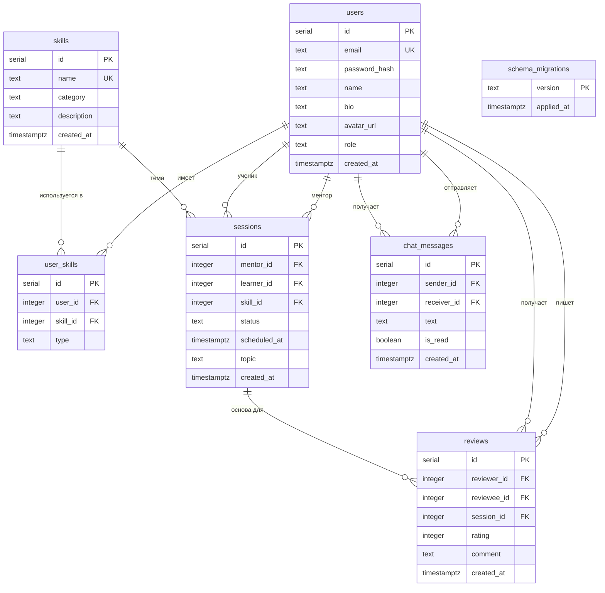
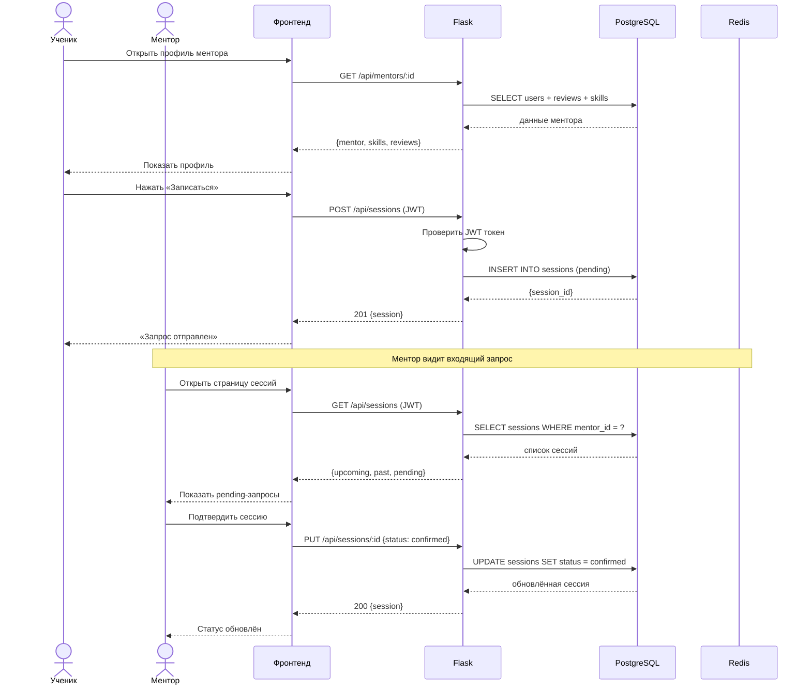
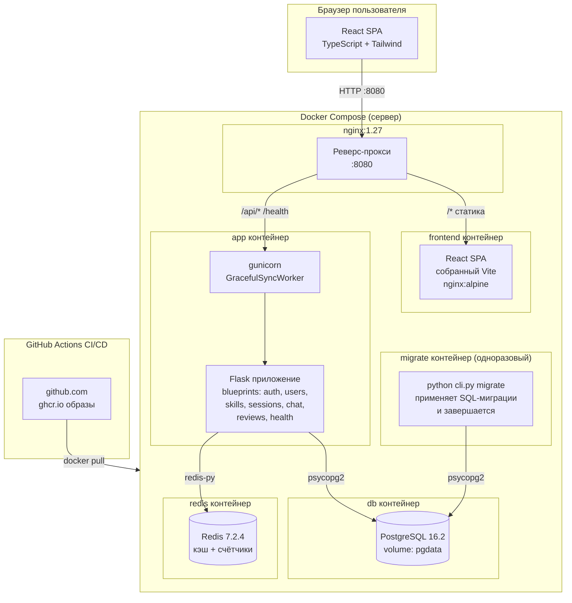

# Архитектура платформы взаимного обучения

## Use Case диаграмма

```mermaid
flowchart TD
    Гость([Гость])
    Ученик([Ученик])
    Ментор([Ментор])
    Админ([Администратор])

    subgraph Аутентификация
        UC1[Зарегистрироваться]
        UC2[Войти в систему]
        UC3[Выйти из системы]
    end

    subgraph Профиль
        UC4[Просмотреть профиль]
        UC5[Редактировать профиль]
        UC6[Выбрать навыки для обучения]
        UC7[Выбрать навыки для преподавания]
    end

    subgraph Навыки и менторы
        UC8[Просмотреть каталог навыков]
        UC9[Найти менторов по навыку]
        UC10[Просмотреть профиль ментора]
    end

    subgraph Сессии
        UC11[Записаться на сессию]
        UC12[Подтвердить запрос на сессию]
        UC13[Отметить сессию завершённой]
        UC14[Отменить сессию]
        UC15[Просмотреть свои сессии]
    end

    subgraph Отзывы
        UC16[Оставить отзыв после сессии]
        UC17[Просмотреть отзывы о менторе]
    end

    subgraph Чат
        UC18[Написать сообщение]
        UC19[Получить сообщения в реальном времени]
        UC20[Просмотреть историю диалогов]
    end

    subgraph Администрирование
        UC21[Создать администратора через CLI]
        UC22[Применить миграции через CLI]
        UC23[Очистить кэш через CLI]
    end

    Гость --> UC1
    Гость --> UC2

    Ученик --> UC3
    Ученик --> UC4
    Ученик --> UC5
    Ученик --> UC6
    Ученик --> UC8
    Ученик --> UC9
    Ученик --> UC10
    Ученик --> UC11
    Ученик --> UC15
    Ученик --> UC16
    Ученик --> UC17
    Ученик --> UC18
    Ученик --> UC19
    Ученик --> UC20

    Ментор --> UC7
    Ментор --> UC12
    Ментор --> UC13
    Ментор --> UC14

    Админ --> UC21
    Админ --> UC22
    Админ --> UC23
```

---

## ER-диаграмма базы данных

---

## Sequence диаграмма: запись ученика на сессию

---

## Component/Deployment диаграмма

